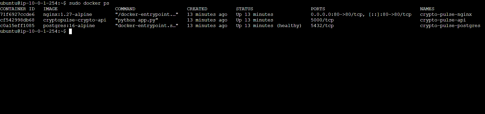
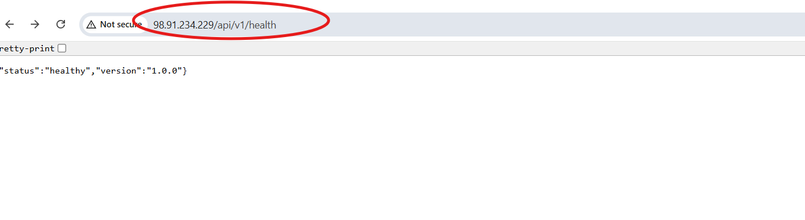
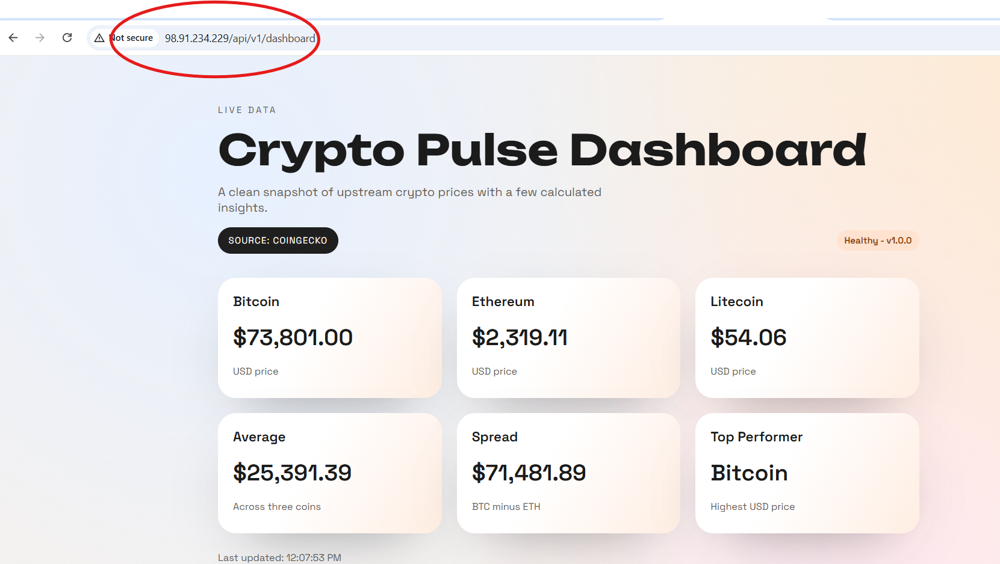

# AWS Deployment Proof (HW15)

## EC2 Info

- Provider: AWS EC2
- Region: `us-east-1`
- Instance type: `t3.micro`
- Instance ID: `i-0fc9471b00e14292f`
- Public IP: `98.91.234.229`

## 1) Cloud Terminal: `docker ps`

```text
NAMES                   IMAGE                    STATUS                   PORTS
crypto-pulse-nginx      nginx:1.27-alpine        Up 6 minutes             0.0.0.0:80->80/tcp, [::]:80->80/tcp
crypto-pulse-api        cryptopulse-crypto-api   Up 6 minutes             5000/tcp
crypto-pulse-postgres   postgres:16-alpine       Up 6 minutes (healthy)   5432/tcp
```

## 2) Backend API via Public IP

- URL: `http://98.91.234.229/api/v1/health`
- Response:

```json
{"status":"healthy","version":"1.0.0"}
```

## 3) Frontend via Public IP

- URL: `http://98.91.234.229/api/v1/dashboard`
- Submission note: `Updated for PR on 2026-04-15`








---

# AWS Networking & Private Compute Proof (HW17)

## Scenario

Project Genesis requires secure backend compute in a private subnet with outbound internet access through NAT only.

## Task 1: NAT Gateway Provisioning

Created NAT Gateway in **Public Subnet** with a newly allocated Elastic IP.

- AWS Console path: `VPC -> NAT Gateways -> Create NAT Gateway`
- Placement: `Public Subnet`
- Elastic IP: `Allocate Elastic IP`
- Status check: wait until NAT state becomes `Available`

### Evidence

- NAT Gateway ID: `nat-0481643eeb3aefb82`
- Public Subnet ID: `subnet-02488955eb66f3b34`
- Elastic IP Allocation ID: `eipalloc-04ad53ef74fe148e0`
- Screenshot file: `Screenshots/hw17-nat-gateway-available.png`


## Task 2: Private Route Table Update

Configured private routing so outbound traffic goes through NAT.

- AWS Console path: `VPC -> Route Tables -> <private-route-table> -> Edit routes`
- Added route:
  - Destination: `0.0.0.0/0`
  - Target: `NAT Gateway -> nat-0481643eeb3aefb82`
- Verified subnet association:
  - `Subnet Associations -> subnet-0fc56da4f6f56a284` is explicitly associated

### Evidence

- Private Route Table ID: `rtb-0835ee64944dccf7f`
- Route Table Association ID: `rtbassoc-03dbef136004ba19c`
- Private Subnet ID: `subnet-0fc56da4f6f56a284`
- Screenshot file: `Screenshots/hw17-private-route-table.png`


## Task 3: Private EC2 Launch

Launched EC2 instance in private subnet with no public ingress and no public IP.

- AWS Console path: `EC2 -> Launch instance`
- Key pair: `Proceed without a key pair`
- Network:
  - VPC: `vpc-0844ea45193c24c15`
  - Subnet: `subnet-0fc56da4f6f56a284`
  - Auto-assign public IP: `Disabled`
- Security Group:
  - Inbound rules: `None`
  - Outbound rules: `Allow all` (default all traffic to `0.0.0.0/0`)

### Evidence

- Instance ID: `i-08f557fa21f50abf1`
- Private IPv4: `10.0.2.153`
- Public IPv4: `None`
- Security Group ID: `sg-01d2505ad8262d306`
- Security Group Name: `hw17-private-ec2-sg-20260420-191504`
- Screenshot file: `Screenshots/hw17-ec2-no-public-ip.png`


## Task 4: Configuration Validation (Session Manager)

Connected to instance via Session Manager and verified outbound internet via NAT.

- AWS Console path: `EC2 -> Instances -> Connect -> Session Manager`
- Command run in terminal:

```bash
ping -c 4 google.com
```

### Terminal Output (paste your real output)

```text
PING google.com (64.233.180.101) 56(84) bytes of data.
64 bytes from pe-in-f101.1e100.net (64.233.180.101): icmp_seq=1 ttl=105 time=2.80 ms
64 bytes from pe-in-f101.1e100.net (64.233.180.101): icmp_seq=2 ttl=105 time=2.34 ms
64 bytes from pe-in-f101.1e100.net (64.233.180.101): icmp_seq=3 ttl=105 time=2.11 ms
64 bytes from pe-in-f101.1e100.net (64.233.180.101): icmp_seq=4 ttl=105 time=2.43 ms

--- google.com ping statistics ---
4 packets transmitted, 4 received, 0% packet loss, time 3006ms
rtt min/avg/max/mdev = 2.113/2.420/2.800/0.247 ms
```

### Evidence Files

- `Screenshots/hw17-session-manager-ping.png`
- `Screenshots/hw17-ec2-no-public-ip.png`


## Submission Checklist

- [ ] NAT Gateway is in a public subnet and `Available`
- [ ] Private route table has `0.0.0.0/0 -> NAT Gateway`
- [ ] Private subnet is explicitly associated with private route table
- [ ] EC2 launched in private subnet with **no** public IPv4
- [ ] Security Group has no inbound rules
- [ ] Session Manager `ping -c 4 google.com` succeeds
- [ ] Screenshots attached in `Screenshots/` and embedded above
